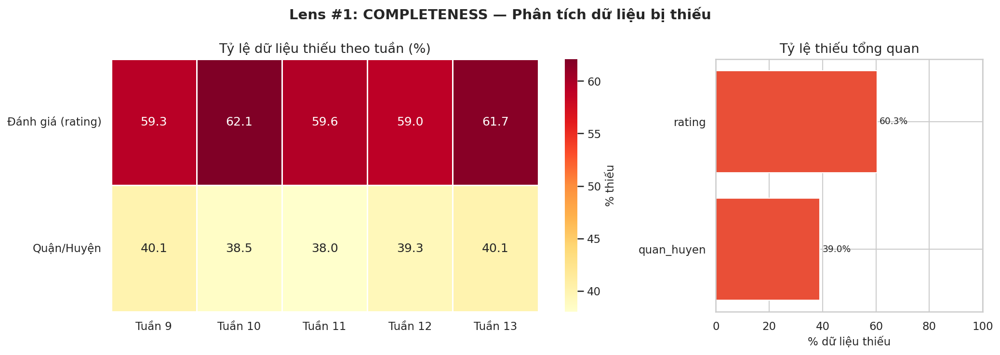
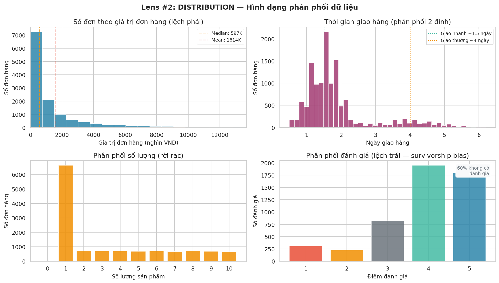
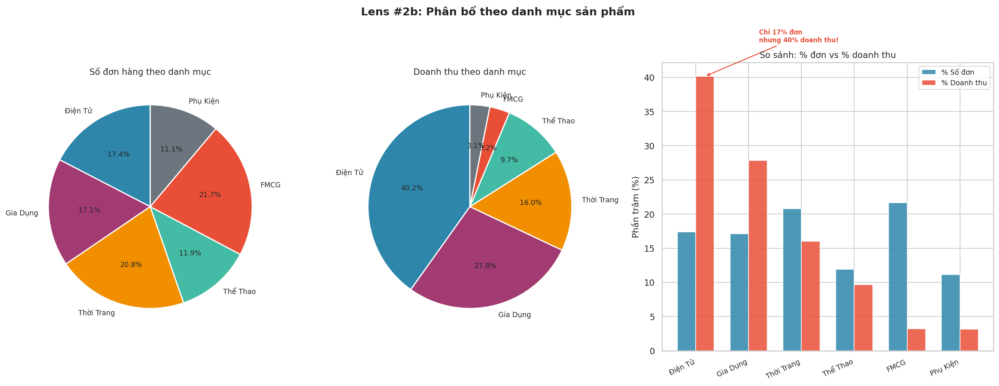
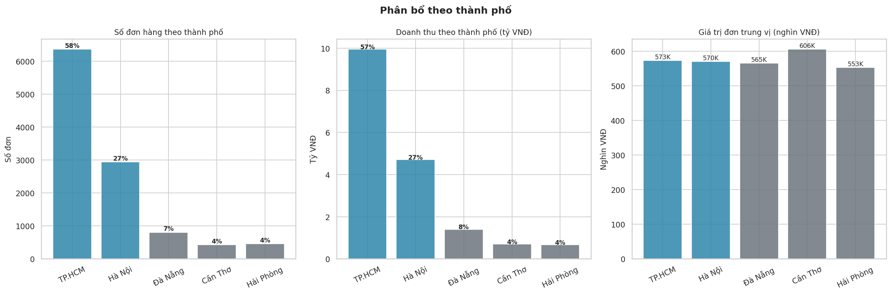
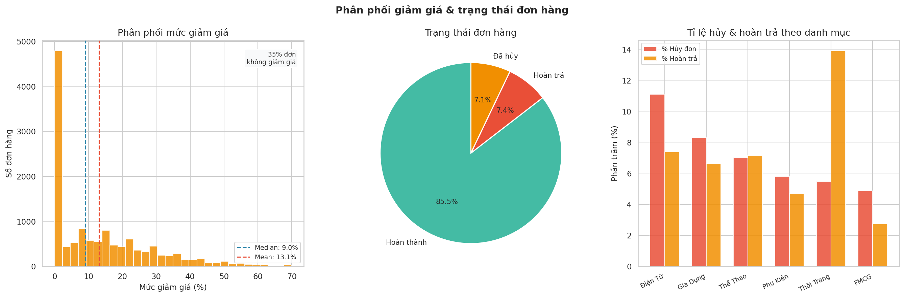

# Chương 1 — Ngày Đầu Tiên
## *File CSV 12,847 dòng — và Andie không biết bắt đầu từ đâu*

---

## Buổi sáng thứ Hai đầu tiên đi làm

Andie, 24 tuổi, vừa tốt nghiệp Kinh tế Ngoại Thương. Ngày đầu làm Junior Analyst tại **TechMart** — một công ty thương mại điện tử mid-size, bán đủ loại từ điện thoại, laptop đến quần áo, đồ gia dụng và hàng tiêu dùng nhanh (nên giá trị đơn hàng dao động rất lớn — từ vài chục nghìn đến vài chục triệu). Cậu chưa bao giờ dùng SQL, chưa viết dòng Python nào.

9h14 sáng, Slack rung lên:

> 💬 **Anh Trung — Head of Data:**
> *"Andie, đây là file đơn hàng tháng 3/2024. Em xem qua và cho anh biết tình hình tháng vừa rồi thế nào nhé. Chiều họp 3 giờ."*

Andie mở file. **12,847 dòng. 11 cột.** Cậu ngồi nhìn trong 3 phút, ngón tay hover trên bàn phím mà chưa gõ gì.

**Phản xạ đầu tiên:** cộng tổng doanh thu. Cậu hào hứng, filter cột "Doanh Thu", bấm SUM. Excel trả về con số: **5,127,841,300đ**.

*Ồ, 5.1 tỷ. Nghe to đấy.*

Cậu chưa để ý đến cột "Trạng Thái". Chưa nhận ra dataset có cả đơn hủy, đơn hoàn trả lẫn lộn với đơn hoàn thành.

10h45, cậu gõ tin nhắn cho anh Trung:

> 💬 **Andie:**
> *"Anh ơi, em xem xong rồi. Doanh thu tháng 3 là 5.1 tỷ ạ!"*

Ba phút sau:

> 💬 **Anh Trung:**
> *"Em tính cả đơn hủy và hoàn trả vào à? Số thật là bao nhiêu?"*

Mặt Andie đỏ bừng. Cậu nhìn lại file — và thấy ngay vấn đề. Cột "Trạng Thái" có ba giá trị: ✅ Hoàn thành, ❌ Đã hủy, 🔄 Hoàn trả. Cậu vừa cộng tất cả vào một.

Filter lại chỉ đơn "Hoàn thành": **4,387,234,000đ**.

Chênh lệch: **740,607,300đ — tức 14.6%**.

**"Mình vừa suýt báo sếp con số sai 14.6%. Ngày đầu đi làm."**

Cậu ngồi yên một lúc. Không phải vì xấu hổ — mà vì cậu đang cố hiểu tại sao mình sai. Không phải do cậu không biết tính. Mà do cậu chưa hỏi: *con số này là gì, tính từ đâu, loại trừ cái gì?*

---

## Dataset TechMart — Tháng 3/2024

| Mã Đơn Hàng | Mã KH | Ngày Đặt | Tên Sản Phẩm | Danh Mục | Số Lượng | Đơn Giá (VNĐ) | Giảm Giá | Doanh Thu | Thành Phố | Trạng Thái |
|---|---|---|---|---|---|---|---|---|---|---|
| DH-00001 | KH-2847 | 01/03/2024 | iPhone 15 Pro 256GB | Điện Tử | 1 | 28,990,000 | 0% | 28,990,000 | TP.HCM | ✅ Hoàn thành |
| DH-00002 | KH-1023 | 01/03/2024 | Áo thun basic trắng | Thời Trang | 3 | 199,000 | 10% | 537,300 | Hà Nội | ✅ Hoàn thành |
| DH-00003 | KH-2847 | 02/03/2024 | AirPods Pro 2nd Gen | Điện Tử | 2 | 5,990,000 | 5% | 11,381,000 | TP.HCM | ✅ Hoàn thành |
| DH-00004 | KH-0291 | 02/03/2024 | Dầu gội Rejoice 650ml | FMCG* | 5 | 85,000 | 0% | 425,000 | Đà Nẵng | ❌ Đã hủy |
| DH-00005 | KH-3301 | 03/03/2024 | Laptop Dell Inspiron 15 | Điện Tử | 1 | 22,500,000 | 15% | 19,125,000 | TP.HCM | 🔄 Hoàn trả |
| DH-00006 | KH-0892 | 03/03/2024 | Quần jean slim fit | Thời Trang | 2 | 450,000 | 0% | 900,000 | Hà Nội | ✅ Hoàn thành |
| DH-00007 | KH-4421 | 04/03/2024 | Máy lọc nước Kangaroo | Gia Dụng | 1 | 3,800,000 | 8% | 3,496,000 | Cần Thơ | ✅ Hoàn thành |
| DH-00008 | KH-1103 | 05/03/2024 | Sữa Ensure Gold 850g | FMCG | 3 | 890,000 | 5% | 2,536,500 | Hà Nội | ✅ Hoàn thành |
| DH-00009 | KH-5512 | 05/03/2024 | Tạ tay 10kg (cặp) | Thể Thao | 1 | 280,000 | 10% | 252,000 | Hải Phòng | ✅ Hoàn thành |
| DH-00010 | KH-2847 | 06/03/2024 | Ốp lưng iPhone 15 Pro | Phụ Kiện | 1 | 350,000 | 0% | 350,000 | TP.HCM | ✅ Hoàn thành |
| ... | ... | ... | ... | ... | ... | ... | ... | ... | ... | *(12,837 dòng nữa)* |

*\*FMCG = Fast-Moving Consumer Goods — hàng tiêu dùng nhanh (sữa, dầu gội, mì gói...): mua thường xuyên, giá thấp, dùng hết nhanh.*

---

> ⏸ **DỪNG LẠI 5 PHÚT — Thực hành tư duy**
>
> Bạn vừa nhận file này. TRƯỚC KHI làm bất cứ thứ gì — ghi ra giấy:
> 1. Bạn nhận thấy điều gì "trông lạ" khi nhìn bằng mắt thường?
> 2. Cột nào bạn nghi ngờ có thể có vấn đề? Tại sao?
> 3. Bạn cần hỏi sếp điều gì trước khi bắt đầu?
>
> *Đừng đọc tiếp cho đến khi bạn thực sự nghĩ xong 3 câu hỏi trên.*

---

## Andie nhìn data — Lần quét đầu tiên

Sau sai lầm đầu tiên, Andie không vội tính lại. Cậu lấy tờ giấy A4 và buộc mình phải hỏi:

**"Dữ liệu này về ai, cái gì, khi nào, từ đâu, để làm gì?"**

Câu hỏi đó tưởng đơn giản nhưng buộc Andie phải nhận ra thêm hai điều cậu chưa biết: "doanh thu" trong file là trước hay sau giảm giá? Và tháng 3 đã đủ 31 ngày chưa?

Cậu nhắn hỏi anh Trung 3 câu. Nhận lại:

> 💬 **Anh Trung:**
> - *"Doanh thu là SAU giảm giá rồi nhé."*
> - *"Tháng 3 mới đến ngày 28 — data chưa đủ."*
> - *"Đã hủy và hoàn trả thì KHÔNG tính doanh thu."*

> 💡 **Insight:** Ba câu hỏi này — Andie chỉ hỏi sau khi đã báo sai một lần. Bài học không phải là "hỏi vì thủ tục" — mà là: **hỏi vì mày vừa sai và cần hiểu tại sao.** Một câu hỏi đúng lúc = tiết kiệm cả buổi chiều làm lại, và tránh được con số sai 14.6% trước mặt sếp.

---

## 🔭 Lens #1: COMPLETENESS

> *Trước khi phân tích bất cứ thứ gì, hỏi: data có ở đó không? Thiếu ở đâu, thiếu theo pattern gì?*

Andie bắt đầu "quét sức khỏe" của dataset. Không phải tính toán — mà là nhìn.



*Hình 1: Heatmap missing values và % thiếu trung bình theo cột.*

**Kết quả kiểm tra Completeness:**

| Cột | % Missing | Loại Missing | Xử Lý | Ảnh Hưởng |
|---|---|---|---|---|
| Rating KH | ~60% | Không ngẫu nhiên (KH tức mới rate) | Dùng cẩn thận, ghi chú bias | Không đại diện cho KH hài lòng |
| Quận/Huyện | ~38% | Systematic (app không require) | Bỏ qua geo-analysis cấp quận | Chỉ phân tích cấp tỉnh/thành |
| Trạng Thái | ~1% | Ngẫu nhiên (lỗi nhập) | Fill từ hệ thống order | Thấp, không ảnh hưởng |
| Doanh Thu | ~0.1% | Logic error | Tính lại từ đơn giá × qty | Cần fix trước tổng hợp |
| Các cột còn lại | 0% | Không missing | — | ✅ Sạch |

> 💡 **Insight:** Cột "Rating KH" thiếu ~60% — **không phải ngẫu nhiên**: KH chỉ rating khi không hài lòng. Đây là Survivorship Bias ngay từ đầu. Cột "Quận/Huyện" thiếu ~38% — **systematic**: data nhập từ app mobile không require field này. Hai loại missing khác nhau → cách xử lý hoàn toàn khác nhau.

---

## 🔭 Lens #2: DISTRIBUTION

> *Shape của data quyết định metric nào bạn nên dùng. Right-skewed → Median. Normal → Mean OK.*

Sau khi biết data có ở đó không, câu hỏi tiếp theo: **data trông như thế nào?**

Andie sort cột doanh thu và nhận ra ngay: có đơn 50,000đ, có đơn 28,990,000đ. Khoảng cách cực kỳ lớn. Tính mean hay median?



*Hình 2: 4 loại distribution khác nhau trong cùng 1 dataset.*

**4 cột, 4 câu chuyện:**

| Cột | Distribution | Vấn đề | Kết luận |
|---|---|---|---|
| Doanh thu | Right-skewed | Mean bị kéo bởi đơn điện tử lớn | Phải dùng **Median**, không phải Mean |
| Thời gian giao hàng | Bimodal (2 đỉnh) | Có 2 nhóm KH hoàn toàn khác nhau | Cần **tách ra** phân tích riêng |
| Số lượng mua | Discrete | 52% đơn chỉ mua 1 sản phẩm | Cơ hội **cross-sell** lớn |
| Rating | Left-skewed | Survivorship bias — KH hài lòng không rate | **Đừng tin** đây là rating đại diện |

Andie ghi vào notes: *"Không dùng mean cho doanh thu. Median = 391,000đ. Mean = 887,000đ. Chênh lệch 2.27x — nếu báo mean, sếp sẽ có kỳ vọng sai về giá trị đơn hàng điển hình."*

### Phân bổ theo danh mục — Ai đang "gánh" doanh thu?

Nhìn distribution xong, Andie hỏi tiếp: *"Danh mục nào bán nhiều nhất? Danh mục nào tạo ra nhiều doanh thu nhất? Hai câu này có cùng đáp án không?"*



*Hình 2b: So sánh % số đơn vs % doanh thu theo danh mục — Điện Tử chiếm ít đơn nhưng gánh phần lớn doanh thu.*

> 💡 **Insight:** Điện Tử chỉ chiếm ~18% số đơn nhưng tạo ra ~41% doanh thu. Ngược lại, Thời Trang và FMCG có nhiều đơn nhưng giá trị thấp. Đây là dấu hiệu đầu tiên của **Concentration** (Lens #5) — nhưng Andie chưa biết điều đó.

### Phân bổ theo thành phố — Ai đang mua ở đâu?

Andie nhìn thêm cột City: *"TP.HCM và Hà Nội chiếm bao nhiêu? Tỉnh khác thì sao?"*



*Hình 2c: TP.HCM doanh thu gấp 10 lần Cần Thơ — nhưng giá trị đơn trung vị gần nhau (~500-600K). Nghĩa là: người Cần Thơ mua đồ tương tự người HCM, chỉ là ít người mua hơn. Chênh lệch doanh thu do số lượng đơn (volume), không phải do giá trị đơn.*

> 💡 **Insight:** Nếu muốn tăng doanh thu ở tỉnh → cần tăng **số lượng khách** (marketing, mở kênh), không phải upsell đơn đắt hơn — vì giá trị đơn đã tương đương HCM rồi. Ngoài ra, TP.HCM + Hà Nội = 85% đơn hàng → nếu 1 trong 2 thành phố gặp sự cố, doanh thu ảnh hưởng cực lớn. Đây là concentration risk theo chiều địa lý.

### Giảm giá & Trạng thái đơn — Mất bao nhiêu vào hủy/hoàn trả?

Andie nhìn tiếp 2 cột chưa khai thác: discount và status.



*Hình 2d: 35% đơn không giảm giá, số còn lại giảm trung bình ~9%. Tỉ lệ hủy/hoàn trả khác nhau rõ rệt giữa các danh mục.*

> 💡 **Insight:** Thời Trang hoàn trả **14%** (cao nhất) — khách mua online không thử được, mặc không vừa thì trả. Điện Tử hủy đơn **11%** (cao nhất) — khách so giá giữa nhiều sàn rồi đổi ý. FMCG chỉ **3% hoàn trả** — ai mua dầu gội rồi lại đi trả? Mỗi danh mục cần chiến lược giảm hủy/trả khác nhau: Thời Trang cần bảng size chính xác, Điện Tử cần chính sách giá cạnh tranh.

---

## Báo cáo sơ bộ — 11:45 AM

```
📋 BÁO CÁO SƠ BỘ THÁNG 3/2024 (1-28/3) — Andie Nguyen
═══════════════════════════════════════════════════════

TỔNG QUAN
─────────
✅ Đơn hoàn thành: 11,203  |  Doanh thu hợp lệ: 4,387,234,000 VNĐ
❌ Đơn hủy: 892 (7.9%)     |  🔄 Hoàn trả: 752 (6.7%)
📊 Doanh thu/đơn: Median = 391,000đ  (Mean 887,000đ — bị kéo bởi đơn điện tử)

DATA QUALITY ISSUES (cần xử lý trước khi phân tích sâu)
────────────────────────────────────────────────────────
⚠️  Rating KH: 60% missing, không ngẫu nhiên → chỉ dùng làm tham khảo
⚠️  Quận/Huyện: 38% missing → chỉ phân tích cấp tỉnh/thành phố
⚠️  12 dòng doanh thu sai logic → đã recalculate, chênh lệch <0.1%

PHÁT HIỆN NHANH
───────────────
🏆 Điện Tử: 42% doanh thu dù chỉ 18% số đơn (value driver)
📍 TP.HCM: 58% doanh thu  |  HN: 27%  |  Tỉnh khác: 15%
📦 52% đơn chỉ mua 1 sản phẩm → cơ hội upsell/cross-sell lớn
```

---

## Bài Học Chương 1

- **Lens #1 COMPLETENESS:** Luôn kiểm tra missing trước. Missing ngẫu nhiên ≠ Missing có pattern — cách xử lý hoàn toàn khác.
- **Lens #2 DISTRIBUTION:** Shape của data quyết định metric bạn dùng. Right-skewed → Median > Mean.
- Hỏi trước, tính sau: 3 câu hỏi đúng lúc tránh được sai lầm 14.6% trong báo cáo. Andie học điều này sau khi đã báo sai — không phải trước.
- Sai lầm đầu tiên của Andie không phải do dốt. Mà do cậu **chưa đặt câu hỏi về định nghĩa** trước khi bấm tính. Bất kỳ analyst nào cũng từng mắc sai lầm này.
- *"Data bẩn + phân tích đẹp = insight sai."* — Không có gì quan trọng hơn data quality.

---

*→ Chương tiếp theo: [Chương 2 — "Tháng 3 Doanh Số Giảm?"](../02-thang-3-giam/)*
