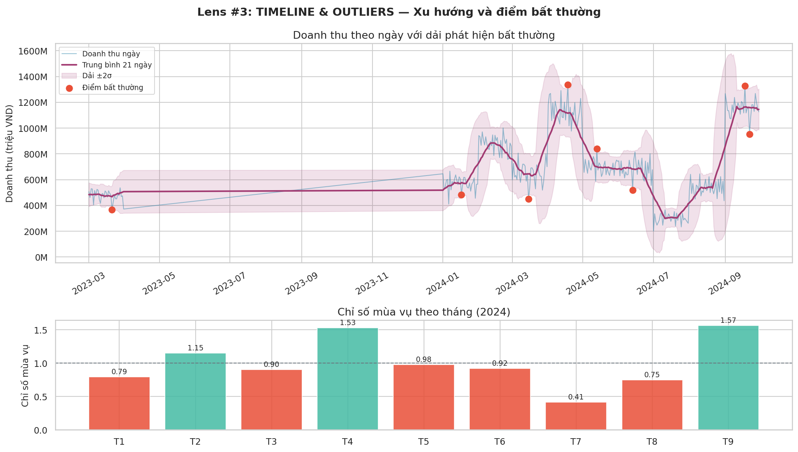

# Chương 2 — "Tháng 3 Doanh Số Giảm — Tại Sao?"
## *Outliers, Timeline và nghệ thuật so sánh đúng*

---

## Câu hỏi bẫy trong cuộc họp

*"Tháng 3 revenue 4.3 tỷ. Tháng 2 là 5.1 tỷ. Giảm 16%. Vấn đề gì thế?"*

Giám đốc kinh doanh — anh Khải — mở đầu cuộc họp thứ Hai bằng câu đó. Cả phòng xôn xao. Ai đó: *"Marketing yếu."* Người khác: *"Thị trường khó."*

Andie nhìn xuống slide thứ 3 trong bộ deck cậu chuẩn bị từ sáng: biểu đồ cột MoM, tháng 2 cao chót vót, tháng 3 thấp hẳn xuống. Cậu đã chuẩn bị xong phần thuyết trình, sẵn sàng đồng thuận.

> 💬 **Andie** *(giơ tay)*:
> *"Đúng rồi anh, giảm 16%... Em có slide MoM breakdown—"*

Cậu bắt đầu chuyển slide. Anh Trung ngồi cuối bàn khẽ nhíu mày.

> 💬 **Anh Trung** *(ngắt lời)*:
> *"Khoan. T2 có Valentine campaign. T3 data mới có 28 ngày. Em đang so sánh kiểu gì vậy?"*

Cả phòng im lặng. Mười lăm người nhìn vào slide của Andie.

Cậu đứng hình. Slide của cậu so sánh tổng revenue tháng 2 với tháng 3 — nhưng tháng 2 có 29 ngày và một campaign lớn, tháng 3 mới chỉ có 28 ngày và không có sự kiện gì. Cậu đang so sánh cam với táo mà không biết.

> 💬 **Anh Trung:**
> *"Tiếp tục đi. Nhưng sau họp em check lại phần này."*

Andie gật đầu, chuyển sang slide tiếp theo. Nhưng cậu không còn nghe gì nữa — đầu cậu đang tính toán lại, nhận ra mình vừa present con số misleading trước 15 người.

Sau họp, cậu về bàn, đóng cửa sổ Slack, và bắt đầu viết ra giấy:

**"Mình vừa present con số misleading trước 15 người. Bài học: KHÔNG BAO GIỜ so sánh mà chưa check context."**

Rồi cậu tự hỏi: *Vậy so sánh đúng trông như thế nào?*

---

## 🔭 Lens #4: TIMELINE

> *Mọi con số đều xảy ra trong thời gian. Trend, seasonality, hay đột biến? Tách ra trước khi kết luận.*



*Hình 3: Timeline doanh thu Jan-Sep 2024. Trên: anomaly detection. Dưới: seasonal index theo tháng.*

> ⏸ **DỪNG LẠI 5 PHÚT**
>
> Nhìn vào 2 biểu đồ trên:
> 1. Bạn thấy bao nhiêu "điểm bất thường"? Điểm nào do lỗi hệ thống, điểm nào do campaign?
> 2. Tháng nào có seasonal index cao nhất? Thấp nhất? Ý nghĩa với forecast là gì?
> 3. "Spike bất thường" tháng 5 (index 2.8x) — bạn sẽ làm gì với điểm này trong analysis?

---

## 🔭 Lens #3: OUTLIERS

> *Outlier không bao giờ tự động bị xóa. Luôn hỏi TẠI SAO trước khi quyết định.*

### 3 loại outlier — 3 cách xử lý hoàn toàn khác nhau

```
🔴 DATA ERROR — Lỗi nhập liệu, lỗi hệ thống
   VD: Revenue âm, qty = 0, ngày đặt hàng 2099
   → Xử lý: Fix hoặc loại. Báo IT.

🟡 VALID EXTREME — Giá trị thật, nhưng hiếm  
   VD: Đơn hàng 500 triệu từ doanh nghiệp B2B
   → Xử lý: Giữ lại nhưng segment riêng.
             Không để làm lệch average.

🟢 SIGNAL QUAN TRỌNG — Điểm bất thường CÓ Ý NGHĨA
   VD: Spike doanh thu đột ngột ngày 30/4 → Tại sao?
   → Xử lý: Điều tra nguyên nhân.
             Đây có thể là insight quan trọng nhất.

⚠️  Sai lầm phổ biến nhất: Xóa outlier mà không hỏi tại sao.
    Người ta đã xóa "điểm bất thường" rồi mới phát hiện ra đó là dấu hiệu fraud.
```

**Phân loại outliers trong dataset TechMart:**

| Outlier Phát Hiện | Giá Trị | Loại | Điều Tra | Kết Luận |
|---|---|---|---|---|
| Đơn hàng qty = 0 | 3 dòng | 🔴 Data Error | Hỏi IT | Test orders — loại |
| Đơn giá = 1,000đ | 1 dòng | 🔴 Data Error | Confirm | Test entry — loại |
| Revenue tháng 2 cao đột biến | 5.1 tỷ | 🟡 Valid Extreme | Kiểm tra calendar | Valentine campaign — giải thích được |
| Spike ngày 30/4 (+180%) | x2.8 TB | 🟢 Signal | Hỏi marketing | Flash sale 30/4 — insight tốt |
| Downtime 5 ngày tháng 7 | -55% revenue | 🔴 Data Error | Confirm IT | System outage — exclude khỏi trend |
| KH mua 15 đơn/tháng | x7 TB | 🟡 Valid Extreme | Check profile | Reseller B2B — segment riêng |

---

## So sánh đúng — Apples-to-apples?

Ngồi lại một mình, Andie không bào chữa. Cậu tự hỏi: *Mình nên check những gì TRƯỚC khi so sánh hai con số?*

Cậu bắt đầu ghi ra. Đây là checklist cậu tự xây sau buổi họp đó:

```
Checklist So Sánh Apples-to-Apples (Andie tự xây — sau lần sai đầu tiên):
□ Khoảng thời gian có bằng nhau? (28 ngày vs 31 ngày = KHÔNG BẰNG)
□ Có sự kiện đặc biệt? (Valentine Day → tăng giả tạo)
□ Định nghĩa có nhất quán? (Revenue gross hay net?)
□ Có yếu tố mùa vụ? (Tháng 12 luôn cao hơn tháng 1)
□ So MoM hay YoY? (YoY loại bỏ seasonality tốt hơn)
```

**Kết quả so sánh đúng:**

| Chỉ Số | Tháng 2/2024 | Tháng 3/2024 | Chênh Lệch | Nhận Xét |
|---|---|---|---|---|
| Doanh thu | 5,100,000,000đ | 4,387,000,000đ | −14% | Nhìn bề ngoài: tệ hơn |
| Số ngày | 29 ngày | 28 ngày (chưa hết) | −3.4% | Không so sánh được! |
| Doanh thu/ngày | 175,862,069đ | 156,679,000đ | −10.9% | Vẫn giảm, nhưng ít hơn |
| Tổng số đơn | 9,821 đơn | 11,203 đơn | **+14.1%** | ← TĂNG! 🤔 |
| Doanh thu/đơn (Median) | 519,593đ | 391,602đ | **−24.6%** | ← Đây mới là vấn đề thật |
| YoY (vs T3/2023) | 3,654,000,000đ | 4,387,000,000đ | **+20.1% ✅** | Thực ra đang tăng trưởng tốt! |

> 💡 **Insight:** Tháng 3 không phải "tệ hơn" — nó đang tăng trưởng **20.1% YoY**. Vấn đề thật là: revenue/đơn giảm 24.6% so với tháng 2. Hai điều này cần 2 giải pháp khác nhau hoàn toàn.

---

## Bài Học Chương 2

- **Lens #3 OUTLIERS:** Phân loại 3 loại trước khi xử lý — Data Error, Valid Extreme, Signal Quan Trọng.
- **Lens #4 TIMELINE:** Nhìn chuỗi thời gian trước khi so sánh. Trend? Seasonality? Hay đột biến?
- MoM mislead khi có seasonality — YoY loại bỏ seasonal effect, đáng tin hơn.
- Waterfall chart và seasonal index giúp nhìn "cái gì thay đổi" thay vì chỉ "thay đổi bao nhiêu".
- Andie xây checklist apples-to-apples KHÔNG phải vì được dạy — mà vì cậu vừa present sai trước 15 người. Đau là cách học nhanh nhất.

---

*→ [Chương 3 — "Khách Hàng Nào Quan Trọng Nhất?"](../03-khach-hang-quan-trong/)*