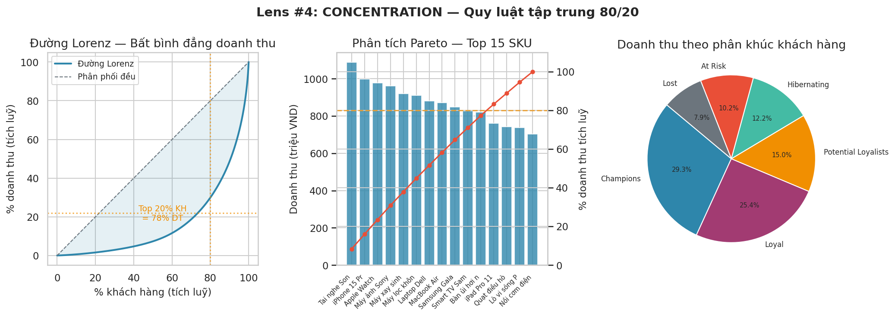
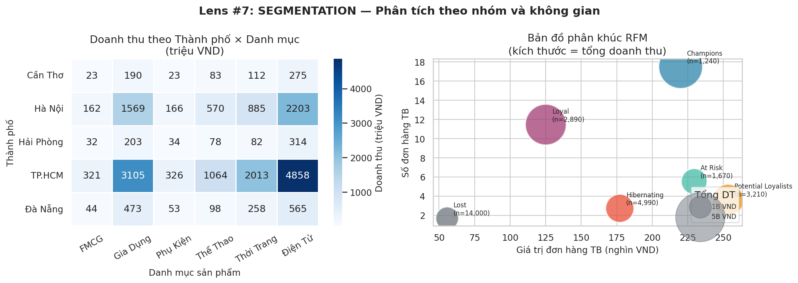

# Chương 3 — "Khách Hàng Nào Quan Trọng Nhất?"
## *Concentration, Segmentation — và cạm bẫy của Average*

---

## 50 triệu ngân sách, 28,000 khách hàng

Tháng thứ 3. Andie đã không còn sợ mở file Excel nữa. Cậu có checklist. Cậu biết hỏi "so với gì?" trước khi kết luận. Cậu tưởng mình đã "ổn".

Rồi sếp đặt ra một bài toán khác hoàn toàn — không phải phân tích, mà là **ra quyết định**.

Sếp đặt vấn đề: *"Ngân sách marketing 50 triệu để giữ chân khách hàng. Em phân tích xem nên tập trung vào nhóm nào để ROI tốt nhất?"*

> ⏸ **DỪNG LẠI 5 PHÚT**
>
> Bạn có 50 triệu và 28,000 khách hàng. Trước khi đọc tiếp:
> 1. Bạn sẽ tiếp cận đều tất cả không? Tại sao không?
> 2. Tiêu chí nào để xác định "khách hàng quan trọng"?
> 3. Nếu chỉ chọn 1 nhóm để tập trung — bạn chọn nhóm nào và dựa trên logic gì?

---

## 🔭 Lens #5: CONCENTRATION

> *80% kết quả đến từ 20% nguyên nhân. Tìm ra con số đó trước khi làm bất cứ thứ gì.*



*Hình 4: Ba cách nhìn concentration — Lorenz curve, Pareto chart, và tỷ trọng revenue.*

**Kết quả phân tích Pareto:**

| Nhóm KH | Số KH | % Tổng KH | Doanh Thu/Năm | % Revenue | Revenue/KH |
|---|---|---|---|---|---|
| Top 5% (VIP) | 1,400 | 5% | 4.9 tỷ | 36% | 3,522,000đ |
| Top 6-20% (Loyal) | 4,200 | 15% | 4.7 tỷ | 34% | 1,709,000đ |
| Mid 21-50% (Regular) | 8,400 | 30% | 3.1 tỷ | 23% | 369,000đ |
| Bottom 50% (Casual) | 14,000 | 50% | 1.1 tỷ | 8% | 78,000đ |

> 💡 **Insight:** Revenue/KH của Top 5% cao gấp **45 lần** Bottom 50%. Đây không phải không công bằng — đây là thực tế của mọi business. Hiểu điều này giúp allocate nguồn lực đúng chỗ.

---

---

Andie nhìn bảng Pareto. Revenue/KH của Top 5% cao gấp 45 lần Bottom 50%. Con số này làm cậu dừng lại.

*"Vậy nếu mình chia đều 50 triệu cho 28,000 người — mỗi người được 1,786 đồng. Đó là... gần như 0. Nhưng nếu mình dồn 50 triệu vào 1,400 người top — mỗi người được 35,714 đồng, đủ để gửi một tin nhắn cá nhân hoá."*

Nhưng câu hỏi tiếp theo mới khó: **ai trong số 1,400 người đó thực sự cần được chăm sóc? Ai đã loyal sẵn? Ai đang sắp bỏ đi?** Chỉ nhìn revenue thôi thì không đủ. Cậu cần nhìn đa chiều hơn.

## 🔭 Lens #8: SEGMENTATION

> *Average luôn che giấu sự khác biệt quan trọng. Segment trước, conclude sau.*



*Hình 5: Segmentation theo nhiều chiều — heatmap 2D và segment map.*

### Lần segment đầu tiên — và tại sao nó sai

Trước khi đến RFM, Andie đã thử một cách đơn giản hơn.

Cậu sort 28,000 khách hàng theo tổng doanh thu, chia thành 3 nhóm: **High / Medium / Low**. Nhóm "High" — top 30% doanh thu — được đề xuất nhận toàn bộ ngân sách marketing.

Cậu trình bày với sếp:

> 💬 **Andie:**
> *"Em đề xuất phân bổ 50 triệu vào nhóm High Revenue — 8,400 khách hàng này tạo ra hầu hết doanh thu."*

> 💬 **Sếp** *(lật qua danh sách)*:
> *"Em có biết trong nhóm 'High' của em có những người mua 1 lần 10 triệu rồi biến mất 6 tháng không? Sao lại cho họ marketing budget?"*

Andie im lặng.

> 💬 **Sếp:**
> *"Một người mua 200,000đ mỗi tuần suốt 6 tháng có giá trị hơn người mua 10 triệu một lần. Em đang segment bằng gì vậy?"*

*"Bằng revenue."*

*"Chỉ revenue thôi?"*

**"Segment bằng 1 chiều = segment mù. Phải nhìn đa chiều."**

Cậu về bàn, xóa file segment cũ, và bắt đầu tìm hiểu: nếu không chỉ dùng revenue — thì dùng gì?

### RFM — Phân khúc khách hàng chuyên nghiệp

```
R — Recency:   Lần cuối mua hàng cách đây bao lâu? (Gần = điểm cao)
F — Frequency: Đã mua bao nhiêu lần trong 6 tháng qua? (Nhiều = điểm cao)
M — Monetary:  Tổng chi tiêu là bao nhiêu? (Cao = điểm cao)
```

**6 nhóm RFM — TechMart 28,000 KH:**

| Segment | Đặc Điểm | Số KH | % Revenue | Avg Revenue/KH | Chiến Lược |
|---|---|---|---|---|---|
| 🏆 Champions | Mua gần, nhiều, chi nhiều | 1,240 | 29.7% | 3,270,000đ | Reward VIP, upsell |
| 💚 Loyal Customers | Mua đều đặn, ổn định | 2,890 | 25.0% | 1,181,000đ | Loyalty program |
| 🌱 Potential Loyalists | Mới mua, tiềm năng cao | 3,210 | 15.2% | 646,000đ | Nurture, educate |
| 💤 Hibernating | Rất lâu không thấy | 4,990 | 12.0% | 328,000đ | Reactivation nhẹ |
| ⚠️ At Risk | Từng mua nhiều, lâu không thấy | 1,670 | 10.2% | 831,000đ | **← WIN-BACK ĐÂY** |
| 💀 Lost | Không mua >180 ngày, giá trị thấp | 14,000 | 8.0% | 78,000đ | Ignore (ROI âm) |

Andie nhìn bảng RFM mới. 6 nhóm rõ ràng. Lần đầu tiên cậu cảm thấy mình nhìn thấy **con người** trong data — không chỉ là dòng trong Excel, mà là những khách hàng thật: Champions đang hài lòng, At Risk đang lặng lẽ rời đi, Lost đã không quay lại.

Nhưng trước khi gửi báo cáo cho sếp, cậu check thêm một thứ: retention tổng hợp. Và phát hiện ra điều kỳ lạ.

### Simpson's Paradox — Khi Average Nói Dối

```
Hiện tượng: Retention tổng hợp = 42%, nhưng KHÔNG khu vực nào đạt 42%.

• TP.HCM:      38%  (15,000 KH) ← Đông nhất, kéo tổng về phía nó
• Hà Nội:      41%   (8,000 KH)
• Tỉnh khác:   52%   (5,000 KH)
• TỔNG:        42%  ← Bị dominated bởi TP.HCM

Nguyên nhân: Weighted average bị dominated bởi nhóm có size lớn nhất.
Bài học: Khi thấy average "lạ", phân tách theo segment ngay.
```

> 💡 **Insight:** Nhóm "At Risk" (1,670 người) tạo 19% doanh thu (~3.46 tỷ/năm). Nếu giữ được 30% trong nhóm này quay lại → revenue tăng thêm ~1 tỷ/năm = ROI 20x so với 50 triệu đầu tư.

---

Andie gửi đề xuất cuối cùng cho sếp: **Dồn 35 triệu (70%) vào nhóm At Risk — win-back campaign cá nhân hoá. 15 triệu (30%) còn lại vào Champions — loyalty reward để giữ chân.** Không chi đồng nào cho Lost — ROI âm.

Sếp đọc xong, chỉ nhắn: *"Approve. Gửi cho Marketing triển khai."*

Đó là lần đầu tiên Andie thấy analysis của mình trở thành **hành động thật** — không chỉ nằm trong report.

---

## Bài Học Chương 3

- **Lens #5 CONCENTRATION:** 20% KH tạo 78% revenue. Tìm ra 20% đó trước khi làm bất cứ thứ gì.
- **Lens #8 SEGMENTATION:** Simpson's Paradox — average tổng hợp có thể ngược chiều với từng subgroup.
- RFM biến 28,000 người thành 6 nhóm có thể hành động cụ thể.
- Nhóm "At Risk" là goldmine: đã biết sản phẩm, đã tin tưởng, chỉ cần được nhắc đúng lúc.
- Segment 1 chiều (chỉ revenue) bỏ sót toàn bộ thông tin về recency và loyalty. Andie học điều này sau khi bị sếp lật ngược đề xuất.

---

*→ [Chương 4 — "Cái Gì Đang Predict Cái Gì?"](../04-correlation-volatility/)*