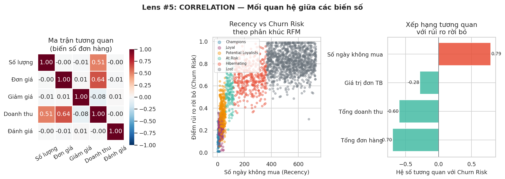
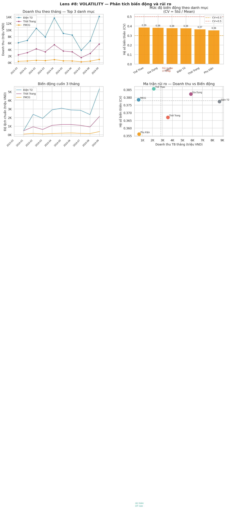

# Chương 4 — "Cái Gì Đang Predict Cái Gì?"
## *Correlation, Volatility — và cách đặt câu hỏi đúng về risk*

---

## Từ mô tả sang dự đoán

Tháng thứ 5. Sếp đặt bài toán: *"Andie, em có thể dự đoán KH nào sắp rời đi không? Và danh mục nào đang rủi ro nhất?"*

Đây là 2 câu hỏi khác nhau về cơ bản: một cái về **pattern trong data**, một cái về **độ ổn định**. Cần 2 lens khác nhau.

---

## 🔭 Lens #6: CORRELATION

> *Thứ gì liên quan đến thứ gì? Correlation cho bạn signal để theo đuổi — nhưng không bao giờ là bằng chứng nhân quả.*



*Hình 6: Correlation analysis — Ma trận, scatter Recency vs Churn, ranking theo feature.*

> ⏸ **DỪNG LẠI 5 PHÚT**
>
> Nhìn vào biểu đồ correlation:
> 1. Feature nào correlate mạnh nhất với Churn Risk? Chiều dương hay âm?
> 2. Nếu chỉ được dùng 2 feature để predict churn — bạn chọn 2 feature nào?
> 3. Frequency và Revenue có correlation mạnh với nhau không? Điều đó có nghĩa gì?

### Correlation ≠ Causation — Mãi Mãi Nhớ

```
❌ Ví dụ sai lầm kinh điển:
   • Kem bán chạy vào mùa hè → người chết đuối cũng nhiều hơn
     (Cả 2 cùng tăng do mùa hè — không phải kem gây đuối nước)

   • Nicolas Cage xuất hiện nhiều trong phim → tỷ lệ chết đuối tăng (r = 0.67!)
     (Hoàn toàn vô nghĩa — spurious correlation)

✅ 3 cách duy nhất để prove causation:
   1. Randomized Controlled Trial (A/B test)
   2. Natural experiment
   3. Cơ chế hợp lý + loại trừ confounders

Correlation cho bạn HYPOTHESIS.
Experiment PROVE (hoặc disprove) nó.
```

**Kết quả correlation với Churn Risk — TechMart:**

| Feature | Correlation với Churn | Diễn giải |
|---|---|---|
| Recency (ngày kể từ mua cuối) | **+0.71** (rất mạnh) | Lâu không mua → Churn cao |
| Frequency (đơn/tháng) | **−0.58** (mạnh) | Mua thường xuyên → Ít churn |
| Rating trung bình | **−0.44** (trung bình) | Rating thấp → Churn cao |
| Số lần hoàn trả | **+0.38** (trung bình) | Hoàn trả nhiều → Churn cao |
| Revenue tổng | **−0.29** (yếu) | Chi nhiều hơn → Ít churn hơn |
| Giới tính | **+0.02** (không có) | Không có signal |

### Sai lầm Andie gần mắc — Correlation ≠ Causation

Nhìn vào bảng trên, Andie thấy ngay: rating trung bình có r = −0.44 với churn. Con số đủ lớn để tự tin. Cậu chuẩn bị một đề xuất và mang ra team meeting:

> 💬 **Andie:**
> *"Rating thấp GÂY RA churn. Nếu chúng ta cải thiện rating — ví dụ qua customer service — churn sẽ giảm."*

Senior analyst Minh — ngồi cạnh cửa sổ, ba năm kinh nghiệm — ngẩng đầu lên:

> 💬 **Minh:**
> *"Khoan. Em đang nói correlation hay causation? Có thể cả rating thấp lẫn churn đều do cùng một nguyên nhân — ví dụ shipping delay vừa khiến rating thấp, vừa khiến khách bỏ đi. Em cải thiện customer service nhưng không fix shipping thì sao?"*

> 💬 **Andie:**
> *"Ơ... đúng rồi..."*

Minh đứng dậy, vẽ lên bảng trắng:

```
Shipping Delay
    │
    ├──→ Rating thấp  ─┐
    │                   ├──→ (Andie nghĩ: Rating gây ra Churn)
    └──→ Churn cao   ──┘

Sự thật: Cả hai đều là HỆ QUẢ của cùng một nguyên nhân.
```

> 💬 **Minh:**
> *"Confounding variable. Em nhìn r = −0.44 và kết luận nhân quả. Đây là sai lầm cơ bản nhất trong data analysis."*

**"Mình đã nhìn r = −0.44 và kết luận nhân quả. Sai lầm cơ bản nhất trong data analysis."**

Andie ghi lại — không phải vì Minh bảo ghi, mà vì cậu vừa suýt đề xuất một giải pháp sai hoàn toàn dựa trên một kết luận sai.

---

## 🔭 Lens #9: VOLATILITY

> *CV (Coefficient of Variation) = Std Dev / Mean × 100%. CV cao = khó forecast = cần buffer cao hơn.*



*Hình 7: So sánh volatility 3 nhóm sản phẩm và Risk Matrix.*

**Kết quả phân tích Volatility:**

| Danh Mục | CV (%) | Khó Forecast? | Chiến Lược |
|---|---|---|---|
| FMCG (Sữa, gạo) | 8% | Dễ ✅ | Forecast với confidence cao, inventory thấp |
| Điện Tử | 31% | Trung bình 🟡 | Forecast theo segment (flagship vs mid-range) |
| Thời Trang | 28% | Trung bình 🟡 | Seasonal inventory, liquidation plan rõ |
| Bundle/Campaign | 78% | Rất khó 🔴 | Không forecast — dùng scenario planning |
| Gia Dụng | 22% | Thấp ✅ | Forecast ổn, inventory theo trend |

```
Quy tắc nhanh:
CV < 20%  → Ổn định, forecast đáng tin
CV 20-50% → Moderate, cần wider confidence interval
CV > 50%  → Volatile, đừng forecast — scenario plan thay thế
```

> 💡 **Insight:** FMCG CV = 8% → forecast tin cậy ±10%. Bundle CV = 78% → forecast vô nghĩa. Sai lầm phổ biến: dùng cùng 1 model để forecast cả FMCG lẫn Bundle — hoàn toàn khác nhau.

---

## Bài Học Chương 4

- **Lens #6 CORRELATION:** Tìm signal bằng correlation matrix trước khi build model. Nhưng correlation ≠ causation.
- **Lens #9 VOLATILITY:** CV = Std/Mean. CV < 20% → ổn định. CV > 50% → volatile, dùng scenario planning.
- Risk Matrix (Volatility × Impact) giúp prioritize danh mục nào cần quản lý chặt nhất.
- Sai lầm phổ biến: dùng cùng 1 model để forecast cho tất cả danh mục có volatility khác nhau.
- Confounding variable là lý do correlation không bao giờ là bằng chứng nhân quả. Andie học điều này khi gần đề xuất một can thiệp sai hoàn toàn.

---

*→ [Chương 5 — "Kể Chuyện Đúng Với Đúng Người"](./05-ke-chuyen-dung-nguoi.md)*