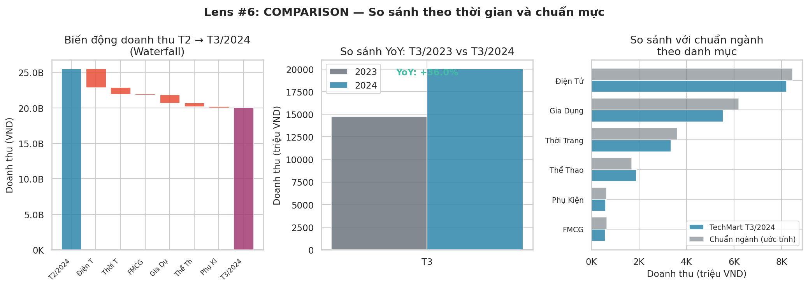

# Chương 5 — "Kể Chuyện Đúng Với Đúng Người"
## *Comparison, Storytelling — Biến insight thành quyết định*

---

## Insight hay mà không ai hiểu = không có giá trị

Tháng thứ 8. Andie được mời báo cáo thẳng với CEO — 15 phút, không có background kỹ thuật.

Cậu chuẩn bị kỹ. Rất kỹ. **51 slide.**

Slide 1-5: bối cảnh thị trường. Slide 6-12: methodology và data sources. Slide 13-24: correlation analysis. Slide 25-37: segmentation breakdown. Slide 38-47: timeline và anomaly detection. Slide 48-51: khuyến nghị.

Cậu nghĩ: *Đủ. Mình đã cover hết mọi góc độ.*

---

### Cuộc họp 15 phút — và slide thứ 12

CEO — chị Lan, 45 tuổi — ngồi ở đầu bàn. Hai VP hai bên. Andie bắt đầu trình bày từ slide 1.

Slide 12. Andie đang giải thích correlation matrix.

> 💬 **CEO** *(đặt bút xuống)*:
> *"Andie, tôi không cần biết methodology. Tôi cần biết: chúng ta có đạt Q4 target không — và tôi cần làm gì?"*

Andie dừng lại.

*Câu hỏi đơn giản. Tại sao mình không trả lời được ngay?*

Vì toàn bộ 51 slide của cậu được xây từ dưới lên: data → analysis → insight → khuyến nghị. Kết luận nằm ở slide 48. Cậu cần thêm 36 slide nữa mới đến đó.

> 💬 **CEO:**
> *"Gửi lại cho tôi bản tóm tắt 1 trang trước 5h chiều."*

Rồi chị đứng dậy, cuộc họp kết thúc sau 14 phút. 51 slide — không ai nhìn hết.

---

Andie đi ra khỏi phòng họp, cầm laptop về bàn. Cậu ngồi một lúc, nhìn vào file Powerpoint 51 slide.

*Mình đã làm đúng mọi thứ. Tính đúng. Phân tích đúng. Nhưng mình kể sai câu chuyện.*

Cậu nhắn cho anh Trung: *"Anh ơi, em cần học cách viết executive summary. Gấp."*

Anh Trung gọi ngay. Trong 2 tiếng, anh dạy cậu một framework: **SCQA**.

Vấn đề không phải là thiếu data. Vấn đề là: **data nào, so sánh với gì, và kể theo cấu trúc nào.**

---

## 🔭 Lens #7: COMPARISON

> *Con số tuyệt đối không có nghĩa gì. Context từ comparison mới tạo ra meaning. Luôn hỏi: so với cái gì?*



*Hình 8: 3 cách so sánh khác nhau — mỗi cách cho một loại insight khác nhau.*

### 5 Level So Sánh — Hierarchy of Comparison

```
Level 1 — vs TARGET
   "Chúng ta đang đạt KPI không?"
   VD: Revenue 4.4 tỷ vs target 5 tỷ = 88% → Chưa đạt

Level 2 — vs SAME PERIOD LAST YEAR (YoY)
   "Tăng trưởng thật sự là bao nhiêu?"
   VD: T3/2024 +20.1% vs T3/2023 → Đang tăng trưởng tốt

Level 3 — vs COMPETITOR / INDUSTRY BENCHMARK
   "Chúng ta đang ở đâu trong thị trường?"
   VD: Conversion rate 3.2% vs industry avg 2.8% → Đang outperform

Level 4 — vs CONTROL GROUP
   "Intervention có hiệu quả không?"
   VD: Campaign group 23% vs control group 19% → +4pp lift thực sự

Level 5 — vs THEORETICAL OPTIMUM
   "Còn bao nhiêu room để improve?"
   VD: Best-in-class conversion 5.1% → Chúng ta còn room 1.9pp
```

---

## Framework SCQA — Cấu trúc của mọi báo cáo tốt

```
S — SITUATION
   Cái audience đã biết. Đừng dài.
   "Chúng ta đang trong Q4 — quý quan trọng nhất năm."

C — COMPLICATION
   Điều gì đang thay đổi, đe dọa, cần chú ý?
   "Tuy nhiên, churn rate đang tăng 2.3pp — đe dọa Q4 target."

Q — QUESTION
   Câu hỏi tự nhiên nảy sinh.
   "Chúng ta có đạt Q4 target không và cần làm gì?"

A — ANSWER  ← ĐẶT LÊN ĐẦU, không phải cuối
   "Có thể đạt target nếu can thiệp ngay. Tôi đề xuất 3 actions."
```

**⭐ Bottom Line Up Front:** Người bận muốn nghe kết luận trước, chi tiết sau.

### 6 slide thay vì 51

| Slide | Tiêu Đề (SCQA Style) | Mục Đích |
|---|---|---|
| 1 | Q4 Đang Đi Đúng Hướng — 82% Target Sau 2 Tháng | Reassure |
| 2 | Nhưng Churn Rate Tăng 2.3pp — Cần Xử Lý Ngay | Flag problem |
| 3 | Nguyên Nhân: 2 Nhóm KH Đang Rời Sang Đối Thủ | Diagnose |
| 4 | Forecast Q4: 24 Tỷ Base, Range 20-27.6 Tỷ | Align expectations |
| 5 | 3 Actions, Chi Phí 80tr → Dự Kiến +320tr Revenue | Recommend |
| 6 | Cần Approve Trước 15/11 Để Kịp Double 11 | Call to action |

Andie gửi bản tóm tắt 1 trang lúc 4h47 chiều. Hôm sau, chị Lan lịch họp lại — lần này 15 phút thật sự.

Cậu mở bằng slide đầu tiên: *"Q4 có thể đạt target nếu chúng ta can thiệp ngay vào churn. Tôi đề xuất 3 actions cụ thể."* Rồi mới giải thích tại sao.

Đúng 11 phút.

> 💬 **CEO:**
> *"Đây là báo cáo tốt nhất tôi nhận được từ data team từ trước đến giờ. Vấn đề rõ. Nguyên nhân rõ. Tôi cần làm gì rõ. Approve."*

51 slide → 6 slide. Không phải vì Andie biết ít hơn. Mà vì cậu hiểu rõ hơn: **ai đang nghe, họ cần biết gì, và họ cần ra quyết định gì.**

---

## 5 Nguyên Tắc Biểu Đồ Hiệu Quả

```
1. MỘT BIỂU ĐỒ, MỘT CÂU CHUYỆN
   Đừng nhồi 5 insight vào 1 chart. 5 insights → 5 charts riêng.

2. TITLE LÀ KẾT LUẬN, KHÔNG PHẢI MÔ TẢ
   ✗ "Doanh Thu Theo Tháng"
   ✅ "Doanh Thu Tháng 11 Đạt Mức Cao Nhất Lịch Sử — Tăng 43% YoY"

3. HIGHLIGHT ĐIỂM QUAN TRỌNG
   Màu đậm/đỏ cho điểm cần chú ý. Grayout phần còn lại.
   Nếu mọi thứ đều highlight → không có gì được highlight.

4. XÓA BỎ CHARTJUNK
   Gridlines thừa, 3D effects, drop shadows, gradient fills.
   "Perfection = không thể bỏ thêm thứ gì nữa."

5. SO SÁNH PHẢI CẠNH NHAU, CÙNG SCALE
   Đừng so sánh 2 chart ở 2 trang khác nhau với scale khác nhau.
```

---

## Bài Học Chương 5

- **Lens #7 COMPARISON:** Mỗi con số cần ít nhất 1 baseline. Hierarchy: Target → YoY → Benchmark → Control → Optimum.
- Waterfall chart giúp thấy "cái gì thay đổi" thay vì chỉ "thay đổi bao nhiêu".
- SCQA: Kết luận lên đầu. Người bận muốn biết "bottom line" ngay từ đầu.
- 6 slide tốt > 51 slide đầy đủ. Bớt là nhiều hơn.
- Andie mang 51 slide vào phòng CEO — và bị dừng lại ở slide 12. Không phải vì phân tích sai. Mà vì cấu trúc sai.
- *"Analysis không ai hiểu = không có giá trị, dù chính xác đến đâu."*

---

*→ [Chương 6 — 9 Lens Tổng Hợp](./06-master-framework.md)*